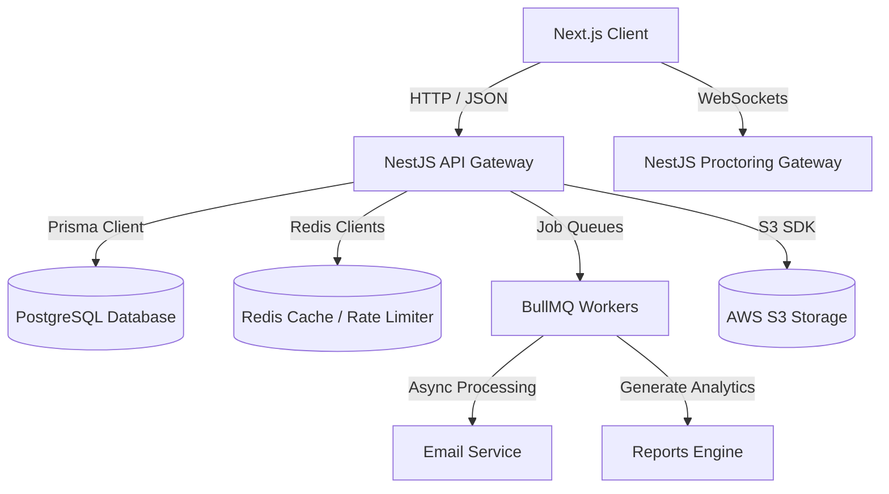
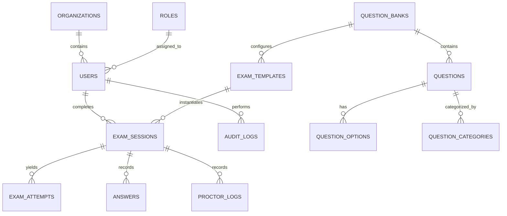
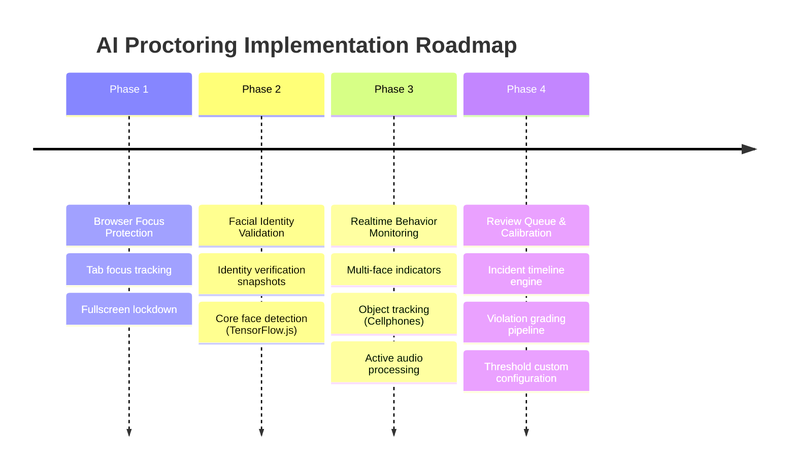

# Development Plan: Digital Assessment Platform

This document serves as the comprehensive architectural blueprint, database design, API specification, and phase-by-phase engineering roadmap for the development of the Digital Assessment Platform. 

---

## 1. Vision
The **Digital Assessment Platform** is a commercial-grade, SaaS application designed to simulate high-stakes professional certification examinations (e.g., AWS, Microsoft, Cisco, CompTIA, Google Cloud, PMI) with absolute fidelity. The platform empowers candidates to experience realistic exam environments, provides immediate diagnostic feedback on domain strengths, and ensures exam integrity via an automated, rules-based proctoring audit log.

---

## 2. Product Goals
* **High-Fidelity UI/UX Replication:** Mimic the interface layout, color schemes, question formats, and navigation constraints of standard vendor exam interfaces (e.g., Pearson VUE, Prometric).
* **Robust Integrity & Auditing:** Track tab switching, camera state, microphone anomalies, and page focus shifts to generate a "Trust Score" for candidate sessions.
* **Instant Diagnostic Reports:** Provide candidates with domain-by-domain scoring, breakdown of correct/incorrect answers, and deep links to study materials immediately upon submission.
* **Streamlined Admin Workflows:** Allow administrators to import questions in bulk, structure exam templates by category weights, and review proctoring violations without technical friction.
* **Resilient Engine Operations:** Ensure zero loss of exam state during power failure, browser crashes, or intermittent network dropouts through automatic client-server state sync.

---

## 3. Functional Scope

### 3.1 Administration Portal
* **Organization Management:** Tenant onboarding, active candidate license allocations, and domain restricts.
* **Question Bank CRUD:** Support for single-choice, multiple-choice, drag-and-drop ordering, case-study questions, and rich-text explanations.
* **Exam Template Builder:** Create dynamic templates mapping domain weighting rules (e.g., 20% AWS IAM, 30% Compute).
* **Candidate Tracking:** Overview of registration details, assigned exams, and status metrics.
* **Proctoring Control Desk:** Admin review queue for flagged sessions containing timestamped video snapshots and violation alerts.
* **Analytics Dashboard:** Aggregate pass rates, average scores per template, and question difficulty analysis.

### 3.2 Candidate Portal
* **Personal Dashboard:** Summary of assigned exams, history, statistics, and quick-start actions.
* **Exam Engine Player:** Clean, distraction-free interface matching vendor styles with active timers, flag buttons, and review lists.
* **Mock Exam Mode:** Untimed practice mode displaying explanations immediately after submission of each question.
* **Simulation Exam Mode:** Timed, strict environment with AI proctoring enabled.
* **Detailed Reports Page:** Review of exam history with interactive visualizations.
* **Notification Center:** Bulletins on newly assigned exams, score availability, and account status.

---

## 4. Non-Functional Requirements (NFR)
* **Performance:** 
  * API response time: Under 200ms (P95) under nominal load.
  * Page load times (Next.js): Under 1.5s (LCP).
  * Auto-save latency: Sub-100ms background execution.
* **Scalability:** System must support 10,000 concurrent active exam engines saving states every 10 seconds without latency degradation.
* **Uptime & Availability:** 99.9% uptime target. Multi-availability zone deployment for database and API instances.
* **Accessibility:** Full WCAG 2.1 Level AA compliance. Screen-reader support, semantic HTML layouts, and complete keyboard navigability.
* **Security:** 
  * Strict RBAC verification on all endpoints.
  * HTTPS enforcement (TLS 1.3).
  * Video and snapshot storage in S3 secured via short-lived pre-signed URLs.
  * Rate-limiting (max 100 requests/minute per IP, max 20 saves/minute on exam engines).
* **Resilience:** Recovery Point Objective (RPO) of 10 seconds for exam state; Recovery Time Objective (RTO) of less than 2 minutes.

---

## 5. Architecture

The system is designed using a Next.js frontend and a modular NestJS backend to share type definitions and maximize development speed.



### 5.1 Technology Selection & Rationale
We utilize **Option B** (NestJS, PostgreSQL, Prisma, Redis, BullMQ) for the backend architecture.
* **NestJS (TypeScript):** Provides rigid structure, dependency injection, and decorators, aligning with the Next.js TypeScript ecosystem.
* **Prisma:** Simplifies relational database mappings with robust migration management and compilation-stage type safety.
* **Redis:** Serves as a rate limiter, session token store, and caching layer for question bank data.
* **BullMQ:** Manages high-throughput background tasks (sending emails, compiling CSV exports, parsing proctoring logs) without blocking the primary event loop.

### 5.2 Code Repository Folder Structure

```
practice-platform/
├── apps/
│   ├── web/                     # Next.js Frontend
│   │   ├── src/
│   │   │   ├── app/             # Next.js App Router (pages & layouts)
│   │   │   ├── components/      # Reusable UI (Shadcn/UI wrappers)
│   │   │   ├── hooks/           # Custom React hooks (useExam, useAuth)
│   │   │   ├── services/        # API client requests
│   │   │   ├── store/           # Zustand state management
│   │   │   └── types/           # Domain typescript types
│   │   ├── public/
│   │   └── tailwind.config.js
│   │
│   └── api/                     # NestJS Backend
│       ├── src/
│       │   ├── modules/         # Modular domain folders
│       │   │   ├── auth/
│       │   │   ├── user/
│       │   │   ├── question/
│       │   │   ├── exam/
│       │   │   └── proctor/
│       │   ├── common/          # Interceptors, guards, exceptions
│       │   ├── prisma/          # Prisma schema and seed files
│       │   ├── main.ts
│       │   └── app.module.ts
│       ├── test/                # NestJS integration/e2e tests
│       └── package.json
│
├── package.json                 # Monorepo configs (npm/pnpm workspaces)
└── docker-compose.yml           # Local dependency engine orchestrator
```

### 5.3 Coding Standards
* **Formatting:** ESLint configurations extending `eslint-config-next` (Frontend) and `@nestjs/schematics` (Backend). Prettier configurations enforced via Pre-commit hooks (`husky`).
* **Naming Conventions:**
  * Variables/Functions: `camelCase`
  * Classes/Interfaces/Types: `PascalCase`
  * Database fields: `snake_case` (mapped to `camelCase` in Prisma schema files)
  * Files: `kebab-case` (e.g. `exam-player.tsx`, `auth.controller.ts`)
* **Error Handling:** Global Exception Filters in NestJS; Error Boundaries on Next.js routes. Error bodies always return standard format: `{ status: string, error: { message: string, code: string, timestamp: string } }`.
* **State Management:** Zustand for UI states (sidebar toggles, active profile settings) and local React hook states for the Exam Engine. React Query (TanStack Query) for server data synchronization.
* **Branching Strategy:** Gitflow.
  * `main` (Production release only)
  * `develop` (Integration branch for staging builds)
  * `feature/*` (Feature development)
  * `bugfix/*` (Issue resolution)
  * `release/*` (Final regression testing and validation)

---

## 6. Database Design



### 6.1 Entity Definitions & Attributes

#### Organization
* `id` (UUID, PK)
* `name` (VARCHAR, Unique)
* `logo_url` (VARCHAR, Nullable)
* `created_at` (TIMESTAMP)
* `updated_at` (TIMESTAMP)

#### Role
* `id` (UUID, PK)
* `name` (VARCHAR, Unique) — 'SYSTEM_ADMIN', 'ORG_ADMIN', 'CANDIDATE'
* `permissions` (JSONB) — Array of allowed actions (e.g. `['questions:create', 'users:view']`)

#### User
* `id` (UUID, PK)
* `organization_id` (UUID, FK, Nullable)
* `role_id` (UUID, FK)
* `email` (VARCHAR, Unique)
* `password_hash` (VARCHAR)
* `first_name` (VARCHAR)
* `last_name` (VARCHAR)
* `avatar_url` (VARCHAR, Nullable)
* `is_active` (BOOLEAN, Default True)
* `created_at` (TIMESTAMP)

#### QuestionBank
* `id` (UUID, PK)
* `name` (VARCHAR) — e.g. "AWS Certified Solutions Architect Associate"
* `vendor` (VARCHAR) — e.g. "AWS"
* `code` (VARCHAR) — e.g. "SAA-C03"
* `created_by` (UUID, FK)
* `created_at` (TIMESTAMP)

#### QuestionCategory
* `id` (UUID, PK)
* `question_bank_id` (UUID, FK)
* `name` (VARCHAR) — e.g. "Design Resilient Architectures"
* `description` (TEXT)

#### Question
* `id` (UUID, PK)
* `question_bank_id` (UUID, FK)
* `category_id` (UUID, FK)
* `type` (VARCHAR) — 'SINGLE', 'MULTIPLE', 'DRAG_DROP', 'CASE'
* `stem_text` (TEXT)
* `explanation` (TEXT)
* `explanation_url` (VARCHAR, Nullable)
* `points` (INT, Default 1)
* `difficulty` (VARCHAR) — 'EASY', 'MEDIUM', 'HARD'
* `is_active` (BOOLEAN, Default True)
* `created_at` (TIMESTAMP)

#### QuestionOption
* `id` (UUID, PK)
* `question_id` (UUID, FK)
* `option_text` (TEXT)
* `is_correct` (BOOLEAN)
* `sort_order` (INT)

#### ExamTemplate
* `id` (UUID, PK)
* `question_bank_id` (UUID, FK)
* `name` (VARCHAR)
* `total_questions` (INT)
* `duration_minutes` (INT)
* `passing_score_percentage` (DECIMAL)
* `is_proctoring_enabled` (BOOLEAN)
* `created_at` (TIMESTAMP)

#### ExamTemplateCategoryWeight
* `id` (UUID, PK)
* `exam_template_id` (UUID, FK)
* `category_id` (UUID, FK)
* `question_count` (INT)

#### ExamSession
* `id` (UUID, PK)
* `candidate_id` (UUID, FK)
* `exam_template_id` (UUID, FK)
* `status` (VARCHAR) — 'INITIALIZED', 'ACTIVE', 'PAUSED', 'COMPLETED', 'TERMINATED'
* `started_at` (TIMESTAMP)
* `paused_at` (TIMESTAMP, Nullable)
* `ended_at` (TIMESTAMP, Nullable)
* `time_remaining_seconds` (INT)
* `ip_address` (VARCHAR)
* `browser_user_agent` (VARCHAR)
* `created_at` (TIMESTAMP)

#### ExamAttempt
* `id` (UUID, PK)
* `exam_session_id` (UUID, FK, Unique)
* `score` (DECIMAL)
* `is_passed` (BOOLEAN)
* `report_json` (JSONB) — Cache calculated domain breakdown
* `created_at` (TIMESTAMP)

#### Answer
* `id` (UUID, PK)
* `exam_session_id` (UUID, FK)
* `question_id` (UUID, FK)
* `option_ids` (UUID[], Array of selected options)
* `is_flagged` (BOOLEAN, Default False)
* `time_spent_seconds` (INT, Default 0)
* `updated_at` (TIMESTAMP)

#### ProctorLog
* `id` (UUID, PK)
* `exam_session_id` (UUID, FK)
* `event_type` (VARCHAR) — 'TAB_SWITCH', 'FULLSCREEN_EXIT', 'FACE_LOST', 'MIC_ANOMALY'
* `timestamp` (TIMESTAMP)
* `severity` (VARCHAR) — 'LOW', 'MEDIUM', 'HIGH'
* `snapshot_url` (VARCHAR, Nullable)
* `details` (JSONB)

#### AuditLog
* `id` (UUID, PK)
* `user_id` (UUID, FK)
* `action` (VARCHAR)
* `ip_address` (VARCHAR)
* `details` (JSONB)
* `created_at` (TIMESTAMP)

#### SystemSetting
* `key` (VARCHAR, PK)
* `value` (VARCHAR)
* `description` (TEXT)

---

## 7. API Planning

All endpoints return JSON and require authentication unless specified otherwise. Base URL: `/api/v1`.

### 7.1 Authentication Module
* **POST `/auth/login`**
  * *Purpose:* Authenticate user and return token.
  * *Auth:* None.
  * *Request:* `{ "email": "admin@platform.com", "password": "securepassword123" }`
  * *Response:* `200 OK` with `{ "accessToken": "JWT_TOKEN", "user": { "id": "UUID", "email": "admin@platform.com", "role": "SYSTEM_ADMIN" } }`
  * *Validation:* `email` is valid format, `password` min length 8.
* **POST `/auth/logout`**
  * *Purpose:* Revoke user tokens and add to Redis blacklist.
  * *Auth:* Required.
  * *Request:* Empty.
  * *Response:* `204 No Content`.

### 7.2 Users Module
* **GET `/users/me`**
  * *Purpose:* Retrieve active profile metadata.
  * *Auth:* Required.
  * *Response:* `200 OK` with `{ "id": "UUID", "email": "user@org.com", "first_name": "John", "last_name": "Doe", "organization": { "id": "UUID", "name": "Org A" } }`
* **PATCH `/users/me`**
  * *Purpose:* Update active profile details.
  * *Auth:* Required.
  * *Request:* `{ "first_name": "Johnny", "last_name": "Doe" }`
  * *Response:* `200 OK` with updated user object.

### 7.3 Admin Module (Required Role: `SYSTEM_ADMIN` or `ORG_ADMIN`)
* **GET `/admin/organizations`**
  * *Purpose:* List active organizations.
  * *Response:* `200 OK` with organization list.
* **POST `/admin/organizations`**
  * *Purpose:* Create new organization.
  * *Request:* `{ "name": "Organization B" }`
  * *Response:* `201 Created` with Organization metadata.

### 7.4 Questions Module (Required Role: `SYSTEM_ADMIN` or `ORG_ADMIN`)
* **POST `/questions`**
  * *Purpose:* Create an individual exam question.
  * *Request:* 
    ```json
    {
      "questionBankId": "UUID",
      "categoryId": "UUID",
      "type": "SINGLE",
      "stemText": "What does S3 stand for?",
      "explanation": "Simple Storage Service",
      "difficulty": "EASY",
      "options": [
        { "optionText": "Simple Storage Service", "isCorrect": true, "sortOrder": 1 },
        { "optionText": "Super Storage Service", "isCorrect": false, "sortOrder": 2 }
      ]
    }
    ```
  * *Response:* `201 Created` with created question entity.
* **POST `/questions/import`**
  * *Purpose:* Bulk upload questions via CSV/JSON.
  * *Request:* Multipart file payload (CSV).
  * *Response:* `202 Accepted` with background processing Job ID (`{ "jobId": "UUID" }`).

### 7.5 Exams Module
* **GET `/exams/templates`**
  * *Purpose:* List available exam templates.
  * *Auth:* Required.
  * *Response:* `200 OK` with Template array.
* **POST `/exams/sessions`**
  * *Purpose:* Initialize a new exam attempt session.
  * *Auth:* Required (Candidate).
  * *Request:* `{ "templateId": "UUID" }`
  * *Response:* `201 Created` with `{ "sessionId": "UUID", "timeRemaining": 5400, "questions": [ { "id": "UUID", "stemText": "Text", "options": [...] } ] }` (Excludes answer keys).
* **POST `/exams/sessions/:id/save-answer`**
  * *Purpose:* Save single answer state and persist duration.
  * *Auth:* Required (Candidate).
  * *Request:* `{ "questionId": "UUID", "optionIds": ["UUID"], "timeSpentSeconds": 15, "isFlagged": false }`
  * *Response:* `200 OK` with `{ "success": true }`.
* **POST `/exams/sessions/:id/submit`**
  * *Purpose:* Conclude examination, trigger evaluation pipeline, generate attempt metrics.
  * *Auth:* Required (Candidate).
  * *Request:* Empty.
  * *Response:* `200 OK` with `{ "attemptId": "UUID", "score": 85.0, "isPassed": true }`.

### 7.6 Proctoring Module
* **POST `/exams/sessions/:id/proctor/log`**
  * *Purpose:* Log anomaly from frontend player sensor.
  * *Auth:* Required.
  * *Request:* `{ "eventType": "TAB_SWITCH", "timestamp": "ISO_DATE", "details": {} }`
  * *Response:* `201 Created`.
* **POST `/exams/sessions/:id/proctor/snapshot`**
  * *Purpose:* Process image payload for facial verification.
  * *Auth:* Required.
  * *Request:* Multipart form data containing camera frame payload.
  * *Response:* `200 OK` with anomaly logs if face count !== 1.

### 7.7 Reports & Analytics Module
* **GET `/reports/candidate/attempts`**
  * *Purpose:* Retrieve candidate's historically completed mock exams.
  * *Auth:* Required.
  * *Response:* `200 OK` with historical scores and domain analytics.
* **GET `/reports/candidate/attempts/:id/export`**
  * *Purpose:* Stream generated PDF binary.
  * *Auth:* Required.
  * *Response:* `200 OK` with `Content-Type: application/pdf`.

---

## 8. Frontend Planning

All pages built with Next.js App Router and styled with TailwindCSS and Shadcn/UI components.

### 8.1 Pages Registry

| Route Path | Page Name | Access Control | Major Components | Global State Keys | Core API Calls |
| :--- | :--- | :--- | :--- | :--- | :--- |
| `/login` | Authentication Screen | Public | LoginForm, RegisterForm | `auth.token`, `auth.user` | `POST /auth/login` |
| `/dashboard` | Candidate Home | Candidate | ExamList, StatusOverview, ProgressChart | None | `GET /exams/templates`, `GET /reports/candidate/attempts` |
| `/admin/dashboard` | Admin Home | Admin | OrgMetricsGrid, ActiveSessionsTable | `admin.stats` | `GET /admin/analytics/summary` |
| `/admin/questions` | Question Database | Admin | QuestionTable, BulkImportModal, QuestionEditor | `admin.selectedQuestion` | `GET /questions`, `POST /questions/import` |
| `/admin/exams` | Exam Templates | Admin | TemplateBuilder, WeightConfigurator | `admin.templates` | `POST /exams/templates` |
| `/exams/session/:id` | Exam Player | Candidate (Assigned) | ExamTimer, QuestionViewer, NavigationGrid | `exam.currentSession` | `POST /exams/sessions/:id/save-answer`, `POST /exams/sessions/:id/submit` |
| `/exams/session/:id/result` | Result Summary | Candidate | ScoreGauge, DomainBreakdownChart | None | `GET /exams/attempts/:id` |
| `/profile` | Profile & Settings | Authenticated | ProfileForm, NotificationSettings | `auth.user` | `GET /users/me`, `PATCH /users/me` |

---

## 9. Admin Portal Features

### 9.1 Question Bank Management
* **Rich Question Editor:** WYSIWYG markup for equations, code syntax blocks, and diagrams.
* **Bulk Upload Engine:** Upload handler processing CSV files. Runs validation checks (duplicate question checking, verifying at least one correct option exists) in background worker queues via BullMQ.
* **Domain Tagging:** Every question mapped to specific blueprint nodes.

### 9.2 Dynamic Exam Template Builder
* **Dynamic Blueprint Layouts:** Specify parameters: Total duration, total question count, and category weights.
* **Proctoring Rules Matrix:** Toggleable checkboxes for strictness rules: Tab switching tolerance threshold, block pause abilities, webcam verification checks.

### 9.3 Proctoring Control Dashboard
* **Realtime Monitors:** Watch active sessions with event counters.
* **Audit Inspector View:** Admin timeline of events (e.g. *14:02:11 - Tab focus lost*). Clicking event displays snapshots of camera stream logged at that instance.

---

## 10. Candidate Portal Features

### 10.1 Personal Performance Workspace
* **Analytics Grid:** Interactive bar charts displaying progress across domains (e.g. security vs networking scores).
* **Exam Action Desk:** One-click initialization of practice (instant explanation feedback) or simulation (strict timer, proctored) environments.

### 10.2 Exam Simulation Screen
* Fullscreen layout removing headers and sidebar elements.
* Display panel housing timer warnings (e.g. flashing warning color on reaching final 5 minutes).
* Side grid visualization presenting question state badges: Grey (Unread), Orange (Flagged), Blue (Answered).

---

## 11. Exam Engine

The core logic of the exam player relies on a state machine handling timer loops and debounced state saves.

```
       [Initialize Session]
                |
                v
       [Load Initial State]
                |
                v
   +---> [Wait for Action] <-------------------------+
   |            |                                    |
   |            +---> (Select Answer) ---> [Debounced Autosave]
   |            |                                    |
   |            +---> (Toggle Flag)    ---> [Update Local State]
   |            |                                    |
   |            +---> (Time Alert)     ---> [Sync Remaining Time]
   |            |                                    |
   |            +---> (Disconnect)     ---> [Display Offline Warning]
   |            |
   |            v
   +---- [Submit Session] ---> [Calculate Score] ---> [Generate Attempt Report]
```

### 11.1 Subtasks Checklist

#### 11.1.1 Anti-Tampering High-Precision Timer
* **Client-side Timer:** Avoid using standard setInterval drift. Utilize a Web Worker loop computing time difference using `performance.now()`.
* **State Synchronization:** Keep client timer synchronized with NestJS backend heartbeat checker firing every 60 seconds.

#### 11.1.2 Randomization Strategy
* Implement Fisher-Yates shuffle engine using deterministic seed hashing so exam logs maintain original ordering mapping for audits while preventing candidate cheating.

#### 11.1.3 Recovery & Resiliency Engine
* Hook into browser storage boundaries (`onBeforeUnload` / window page-hide listeners) to save state cache values.
* Re-route users upon network reconnection using active engine state calls.

#### 11.1.4 Accessibility & Shortcuts
* Arrow keys for next/prev. Number keys `1`, `2`, `3`, `4` select corresponding options.
* Full screen reader labels (`aria-live`, `aria-describedby`) for active state prompts.

---

## 12. AI Proctoring Roadmap (Specification & Phases Only)

AI Proctoring implementation is scheduled as a phased expansion, focusing on local client resource processing to minimize SaaS hosting costs.



### Phase 1: Browser Focus Protection (Focus Logs)
* **Tasks:**
  * Track browser `blur` and `focus` events.
  * Enforce full-screen mode on initial exam start and log exit events immediately.
  * Show warning overlay on focus exit. Terminate session automatically if the allowed limit is exceeded.

### Phase 2: Facial Identity Validation (Client-Side Face Detection)
* **Tasks:**
  * Connect to user camera using MediaDevices API.
  * Run lightweight client-side face recognition model (TensorFlow.js FaceMesh / MediaPipe) to verify the correct user is present.
  * Capture identity registration photo before starting and verify matching parameters.

### Phase 3: Realtime Behavior Monitoring (Face & Object Tracking)
* **Tasks:**
  * Monitor active coordinates to catch posture drift (gaze direction analysis).
  * Flag frames where count of detected faces !== 1 (e.g. multiple faces in view or face missing).
  * Perform device presence checks (detecting phone-like bounding boxes in frame).
  * Audio analytics analyzing audio frequencies to flag voices in background room.

### Phase 4: Incident Timeline Engine (Proctor Desk Analytics)
* **Tasks:**
  * Map anomaly log payloads onto a single session timeline.
  * Apply a weighting matrix to compute an overall "Trust Score" (0 to 100%).
  * Build video timeline player in Admin portal displaying frame snapshots captured when violations occurred.

---

## 13. Reporting

* **Candidate Diagnostics:** Score cards breaking down percentages per knowledge domain.
* **Organization Admin Summary:** Cohort completion rates, average scores, and comparison of organizational cohorts.
* **Question Bank Metrics:** Auto-flag questions with abnormally high failure rates (outlier detection for bad question stems).
* **Export Engine:** Generate PDF certificates and CSV detail logs using background queues.

---

## 14. Security

* **Access Control:** Roles (`SYSTEM_ADMIN`, `ORG_ADMIN`, `CANDIDATE`) mapped via custom guards using JWT payloads.
* **Rate Limiting:** IP rate limits on standard routes; strict execution speed limits on answer saving endpoints.
* **Security Headers:** Enforce Content Security Policy (CSP), X-Frame-Options (prevent clickjacking), and X-Content-Type-Options.
* **Data Protection:** PostgreSQL encryption using AES-256 for confidential user identification details. Data backups encrypted at rest in S3.

---

## 15. Testing Strategy

```
[Unit Tests (Jest)] ----> Validate entity transformations & scoring algorithms
      |
      v
[Integration Tests] ----> Verify database relationships, controllers, and transaction rollbacks
      |
      v
[E2E Tests (Playwright)] -> Simulate full Candidate exam path & Admin controls
      |
      v
[Performance (k6)] ----> Load-test autosave handlers under concurrent load
```

### 15.1 Testing Implementation Matrix

| Test Type | Targets / Scope | Tool / Library | Success Metric |
| :--- | :--- | :--- | :--- |
| **Unit** | Scoring algorithms, date helpers, permission checks | Jest | > 85% Code Coverage |
| **Integration** | DB repositories, Prisma connectors, controller pipelines | NestJS Testing Module | Critical transactions pass |
| **E2E** | Multi-step candidate registration, exam submission flow | Playwright | Zero core UI path regressions |
| **Performance** | Save-answer state updates | k6 | P95 latency < 150ms at 2,000 requests/sec |
| **Accessibility** | Frontend pages accessibility evaluation | Axe-core / Playwright-Axe | Zero violations of WCAG 2.1 AA |

---

## 16. DevOps

### 16.1 Infrastructure Environment Configurations

* **Local Environment:**
  * Spin up DB (PostgreSQL), Cache (Redis), and Object Storage (MinIO) via `docker-compose.yml`.
* **Staging Environment (AWS):**
  * Automated builds on merge to `develop` branch.
  * Container images built and stored in AWS ECR.
  * Managed via AWS ECS Fargate task runs.
* **Production Environment (Kubernetes Ready):**
  * Deployment configurations mapped with Helm charts ready for Amazon EKS.
  * Autoscaling triggers configured on target CPU utilization (Target 70% threshold).

### 16.2 Backup & DR Strategies
* **Database Backup:** Automated daily snapshot schedules stored in AWS S3 with lifecycle transition policies to Glacier storage after 30 days.
* **State Recovery:** Failover policies dynamically re-routing active Redis queues to backup instances.

---

## 17. Coding Standards & Development Guidelines

### 17.1 NestJS Controller & Service Pattern
* Controller classes handle request routing, HTTP parsing, and execution routing.
* Business operations reside strictly within injected Service structures.
* Data transformations use Class-Transformer, verified via Class-Validator.

### 17.2 Next.js Component Organization
* Visual elements are broken down into small, single-purpose structures in the components directory.
* Styles are isolated using standard CSS variables and utility classes from TailwindCSS.
* Custom hooks contain the state machines for the exam player and timer.

---

## 18. Phase-by-Phase Development Roadmap

```
Phase 1 : Project Initialization & Environment Setup
    └── Phase 2 : Authentication & Access Layer
         └── Phase 3 : Organization & Profile Services
              └── Phase 4 : Question Management Infrastructure
                   └── Phase 5 : Exam Templates & Builder
                        └── Phase 6 : Core Exam Engine Core
                             └── Phase 7 : Candidate View & Dashboard
                                  └── Phase 8 : AI Proctoring Core Logs
                                       └── Phase 9 : Reports & Export Engines
                                            └── Phase 10 : Optimizations & Deploy
```

---

### Phase 1: Project Initialization & Environment Setup
* **Objectives:** Build monorepo workspaces and outline Docker configuration scripts.
* **Deliverables:** Working repository template, lint setups, and running database/cache dependencies.
* **Acceptance Criteria:** `docker compose up` starts running Postgres, Redis, and local MinIO targets successfully.
* **Complexity:** Low.
* **Duration:** 1 week.

#### Milestone 1: Workspace Skeleton Configuration
* **Task 1.1: Build Monorepo Structure**
  * *Subtask 1.1.1:* Initialize root directory using NPM Workspaces.
  * *Subtask 1.1.2:* Generate standard Next.js typescript template in `/apps/web`.
  * *Subtask 1.1.3:* Generate NestJS project inside `/apps/api` using standard CLI tools.
  * *Dependencies:* None.
* **Task 1.2: Establish Pre-commit Linter Pipelines**
  * *Subtask 1.2.1:* Install ESLint, Prettier, and Husky modules in repository root.
  * *Subtask 1.2.2:* Configure git hooks to run linting validation checks on changes.
  * *Dependencies:* Task 1.1.

#### Milestone 2: Infrastructure Scripting
* **Task 1.3: Docker Compose Environment Preparation**
  * *Subtask 1.3.1:* Create `docker-compose.yml` to provision PostgreSQL v15, Redis v7, and MinIO storage locally.
  * *Subtask 1.3.2:* Write connection test script validating resource availability.
  * *Dependencies:* Task 1.1.
* **Task 1.4: Base Prisma Configuration Setup**
  * *Subtask 1.4.1:* Install Prisma CLI and initialize core backend connector files.
  * *Subtask 1.4.2:* Configure backend environment variables mapping to Docker instances.
  * *Dependencies:* Task 1.3.

---

### Phase 2: Authentication & Access Layer
* **Objectives:** Enable secure login pipelines and role mapping.
* **Deliverables:** Auth controllers, registration layouts, route guards, and token tracking.
* **Acceptance Criteria:** Candidates, Admin Portal Managers, and Organization Managers can register, login, and access distinct routes based on their role permissions.
* **Complexity:** Medium.
* **Duration:** 1 week.

#### Milestone 1: Database Identity Modeling
* **Task 2.1: Implement Identity Schema Tables**
  * *Subtask 2.1.1:* Add schema definitions in Prisma for `Role`, `User`, and `Permission` entities.
  * *Subtask 2.1.2:* Generate and execute database migrations.
  * *Subtask 2.1.3:* Write seed scripts pre-populating roles and permissions.
  * *Dependencies:* Task 1.4.

#### Milestone 2: Core Authentication Logic
* **Task 2.2: Backend Registration & Login Flow**
  * *Subtask 2.2.1:* Build UserService to create and query User data with password hashing.
  * *Subtask 2.2.2:* Write AuthModule, AuthService, and JWT strategies in backend.
  * *Subtask 2.2.3:* Write login and registration endpoints.
  * *Dependencies:* Task 2.1.
* **Task 2.3: Access Protection Guards**
  * *Subtask 2.3.1:* Build a custom JWT Authentication guard in NestJS.
  * *Subtask 2.3.2:* Implement standard Role-Based Access Control decorator checks.
  * *Dependencies:* Task 2.2.

#### Milestone 3: Interface Authorization
* **Task 2.4: Frontend Identity Client Setup**
  * *Subtask 2.4.1:* Establish Zustand auth store logic tracking status states.
  * *Subtask 2.4.2:* Build login UI layout matching standard Shadcn layout grids.
  * *Subtask 2.4.3:* Write client route protection wrappers checking roles.
  * *Dependencies:* Task 2.3.

---

### Phase 3: Organization & Profile Services
* **Objectives:** Standardize tenant profiles and user settings pages.
* **Deliverables:** Tenant management screens, user setup updates, and file-upload hooks.
* **Acceptance Criteria:** Admin accounts can provision organizations and assign candidates. Profile details and avatars update successfully.
* **Complexity:** Low.
* **Duration:** 1 week.

#### Milestone 1: Tenant Model Implementation
* **Task 3.1: DB Schema and Logic Integration**
  * *Subtask 3.1.1:* Add `Organization` entity definitions to database schema profiles.
  * *Subtask 3.1.2:* Write Org controllers and validation services.
  * *Dependencies:* Task 2.1.
* **Task 3.2: Administrator Tenant Dashboard**
  * *Subtask 3.2.1:* Design frontend layout panel displaying active organization lists.
  * *Subtask 3.2.2:* Build "Create Organization" form with validation.
  * *Dependencies:* Task 3.1, Task 2.4.

#### Milestone 2: User Settings Dashboard
* **Task 3.3: Profile Update Support**
  * *Subtask 3.3.1:* Write API routes updating name, password, and configuration preferences.
  * *Subtask 3.3.2:* Implement avatar image upload handler linked to local MinIO storage.
  * *Dependencies:* Task 2.3.
* **Task 3.4: Profile Frontend Interface**
  * *Subtask 3.4.1:* Construct Profile Management dashboard UI view.
  * *Subtask 3.4.2:* Hook forms to profile update APIs.
  * *Dependencies:* Task 3.3, Task 2.4.

---

### Phase 4: Question Management Infrastructure
* **Objectives:** Establish complete CRUD controls for exam questions.
* **Deliverables:** Question editor forms, dynamic category settings, and bulk upload queues.
* **Acceptance Criteria:** Administrative users can create questions manually and trigger CSV file bulk uploads that process in the background.
* **Complexity:** High.
* **Duration:** 2 weeks.

#### Milestone 1: Question Schemas
* **Task 4.1: Database Schemas & Mappings**
  * *Subtask 4.1.1:* Map `QuestionBank`, `Question`, `QuestionOption`, and `QuestionCategory` in Prisma.
  * *Subtask 4.1.2:* Run migrations and verify schemas in database environment.
  * *Dependencies:* Task 1.4.

#### Milestone 2: Question API Logic
* **Task 4.2: CRUD Endpoints**
  * *Subtask 4.2.1:* Implement backend Question controller mapping create/read/update/delete requests.
  * *Subtask 4.2.2:* Write validation logic checking correct option requirements.
  * *Dependencies:* Task 4.1, Task 2.3.
* **Task 4.3: Bulk Import Pipeline**
  * *Subtask 4.3.1:* Set up BullMQ processor context to handle asynchronous import parsing.
  * *Subtask 4.3.2:* Build a parsing module reading input data formats and executing batch inserts.
  * *Dependencies:* Task 4.2.

#### Milestone 3: Question Management Screen
* **Task 4.4: Question Explorer View**
  * *Subtask 4.4.1:* Design question catalog table list with filters for bank, category, and difficulty.
  * *Subtask 4.4.2:* Construct question creation and options builder forms.
  * *Subtask 4.4.3:* Integrate CSV drag-and-drop file upload uploaders.
  * *Dependencies:* Task 4.2, Task 4.3.

---

### Phase 5: Exam Templates & Builder
* **Objectives:** Design configuration controls for template building.
* **Deliverables:** Core template schemas, weight matrices, and builder forms.
* **Acceptance Criteria:** Admin can save dynamic test designs matching exam weights per domain.
* **Complexity:** Medium.
* **Duration:** 1 week.

#### Milestone 1: DB Template Design
* **Task 5.1: Model Schema Setup**
  * *Subtask 5.1.1:* Map `ExamTemplate` and `ExamTemplateCategoryWeight` in database.
  * *Subtask 5.1.2:* Execute migration runs to apply configurations.
  * *Dependencies:* Task 4.1.

#### Milestone 2: Builder API Support
* **Task 5.2: Template Management Services**
  * *Subtask 5.2.1:* Write API controllers managing template entities.
  * *Subtask 5.2.2:* Write logic validating category totals match total template question counts.
  * *Dependencies:* Task 5.1.

#### Milestone 3: Template UI Interfaces
* **Task 5.3: Builder Workspaces**
  * *Subtask 5.3.1:* Build dynamic configuration settings form (Timer limits, Passing scores).
  * *Subtask 5.3.2:* Construct input components mapping weights per question category.
  * *Dependencies:* Task 5.2, Task 4.4.

---

### Phase 6: Core Exam Engine
* **Objectives:** Build the core candidate testing interface and state machine.
* **Deliverables:** Client exam state hook, high-precision Web Worker timer, autosave queue, and scoring algorithms.
* **Acceptance Criteria:** Resilient candidate workspace with automatic state syncing, dynamic timers, and accurate evaluation scoring.
* **Complexity:** High.
* **Duration:** 2 weeks.

#### Milestone 1: Active Session Mappings
* **Task 6.1: DB Session & State Schema**
  * *Subtask 6.1.1:* Map database models for `ExamSession`, `ExamAttempt`, and `Answer`.
  * *Subtask 6.1.2:* Apply migration configurations database side.
  * *Dependencies:* Task 5.1, Task 2.1.
* **Task 6.2: Core Session Management APIs**
  * *Subtask 6.2.1:* Write dynamic endpoints generating exam session questions based on template weights.
  * *Subtask 6.2.2:* Write answers autosave endpoint and database transaction managers.
  * *Dependencies:* Task 6.1.

#### Milestone 2: Client Simulation Shell
* **Task 6.3: State Engine & High-Precision Timer**
  * *Subtask 6.3.1:* Build a Web Worker loop computing time remaining.
  * *Subtask 6.3.2:* Write a custom React state hook tracking selections, flag indices, and navigation state.
  * *Dependencies:* Task 6.2.
* **Task 6.4: Interface View Setup**
  * *Subtask 6.4.1:* Design candidate workspace UI (Question layout, navigation grid, flags).
  * *Subtask 6.4.2:* Bind user inputs to debounced API autosave triggers.
  * *Dependencies:* Task 6.3.

#### Milestone 3: Evaluation Engine
* **Task 6.5: Automated Evaluation Calculations**
  * *Subtask 6.5.1:* Write backend validation services grading correct answer keys.
  * *Subtask 6.5.2:* Build a result generator mapping domain performance percentages.
  * *Dependencies:* Task 6.2.

---

### Phase 7: Candidate View & Dashboard
* **Objectives:** Build candidate workspace dashboards.
* **Deliverables:** Exam selector widgets, progress logs, and candidate scorecard components.
* **Acceptance Criteria:** Candidates can view assigned exams, launch attempts, and review result history.
* **Complexity:** Low.
* **Duration:** 1 week.

#### Milestone 1: Portal Dashboard Layouts
* **Task 7.1: Workspace View Configurations**
  * *Subtask 7.1.1:* Create dashboard landing page featuring summary performance widgets.
  * *Subtask 7.1.2:* Construct target tables grouping available mock exams.
  * *Dependencies:* Task 2.4, Task 5.3.

#### Milestone 2: Review Dashboards
* **Task 7.2: Attempt Review Layouts**
  * *Subtask 7.2.1:* Build exam results summary views with domain-by-domain success rate charts.
  * *Subtask 7.2.2:* Build interactive screen allowing candidate review of correct/incorrect questions with detailed explanations.
  * *Dependencies:* Task 6.5.

---

### Phase 8: AI Proctoring Core Logs
* **Objectives:** Build focus monitors and proctor logs review pages.
* **Deliverables:** Client focus tracking hooks, backend anomaly logging APIs, and Admin review timelines.
* **Acceptance Criteria:** Screen exit alerts log correctly and display chronologically in the administrative monitoring console.
* **Complexity:** Medium.
* **Duration:** 1 week.

#### Milestone 1: Proctor Event Tracking
* **Task 8.1: DB Logging Models**
  * *Subtask 8.1.1:* Model `ProctorLog` tables in database.
  * *Subtask 8.1.2:* Run migrations to apply database changes.
  * *Dependencies:* Task 6.1.
* **Task 8.2: Logger APIs**
  * *Subtask 8.2.1:* Create ingest controller receiving client anomaly data payloads.
  * *Subtask 8.2.2:* Write validation routines ensuring data integrity.
  * *Dependencies:* Task 8.1.

#### Milestone 2: Focus Sensors
* **Task 8.3: Client Monitor Sensors**
  * *Subtask 8.3.1:* Write React listener handlers for window focus blur, fullscreen changes, and tab switches.
  * *Subtask 8.3.2:* Integrate window handlers with active api logger targets.
  * *Dependencies:* Task 8.2, Task 6.4.

#### Milestone 3: Auditor Dashboards
* **Task 8.4: Proctoring Review View**
  * *Subtask 8.4.1:* Design candidate session review timeline view.
  * *Subtask 8.4.2:* Render colored flag markers highlighting detected focus switches.
  * *Dependencies:* Task 8.2.

---

### Phase 9: Reports & Export Engines
* **Objectives:** Implement reporting capabilities.
* **Deliverables:** PDF generator scripts, CSV export workers, and cohort analytics views.
* **Acceptance Criteria:** Clean generation of PDF result score reports and CSV exports of candidate lists.
* **Complexity:** Medium.
* **Duration:** 1 week.

#### Milestone 1: Exporter Scripts
* **Task 9.1: PDF Rendering Logic**
  * *Subtask 9.1.1:* Install and configure PDF generation library (e.g. `pdfkit` or `puppeteer-core`).
  * *Subtask 9.1.2:* Write styling layouts and generator scripts for certificate printing.
  * *Dependencies:* Task 6.5.
* **Task 9.2: CSV Export Pipeline**
  * *Subtask 9.2.1:* Write async export handlers generating CSV documents for organization scores.
  * *Dependencies:* Task 3.1.

#### Milestone 2: Org Analytics Panels
* **Task 9.3: Administrative Analytics Views**
  * *Subtask 9.3.1:* Build graphs plotting aggregated performance metrics across organizational candidate lists.
  * *Subtask 9.3.2:* Integrate download actions mapping to export endpoints.
  * *Dependencies:* Task 9.1, Task 9.2.

---

### Phase 10: Optimizations & Deploy
* **Objectives:** Prepare deployment configurations and perform load testing.
* **Deliverables:** Dockerfiles, GitHub Actions CI pipelines, and k6 performance test suites.
* **Acceptance Criteria:** CI runs tests automatically, and containers deploy to staging environments.
* **Complexity:** Medium.
* **Duration:** 1 week.

#### Milestone 1: Docker Containers Configuration
* **Task 10.1: Build Docker Profiles**
  * *Subtask 10.1.1:* Write optimized production Dockerfiles for frontend Next.js application.
  * *Subtask 10.1.2:* Write production-grade Dockerfile for API NestJS service.
  * *Dependencies:* Task 1.1.

#### Milestone 2: Automated Pipeline Setup
* **Task 10.2: CI/CD Pipelines Scripting**
  * *Subtask 10.2.1:* Write GitHub Actions workflow running tests on pull requests to develop.
  * *Subtask 10.2.2:* Configure build tasks compiling and pushing container images.
  * *Dependencies:* Task 10.1.

#### Milestone 3: Testing & Handover
* **Task 10.3: Performance Load Auditing**
  * *Subtask 10.3.1:* Write k6 script simulating multiple users posting answers to active sessions.
  * *Subtask 10.3.2:* Execute benchmarking runs and configure database indexes for performance bottlenecks.
  * *Dependencies:* Task 10.2, Task 6.2.

---

## 19. Sprint Plan

Each sprint represents a 1-week iteration.

### Sprint 1: Foundation & Base Environment
* **Goals:** Configure workspaces, build database adapters, and ensure local services start cleanly.
* **Stories:**
  * As a developer, I want all workspaces and build tools configured so I can write code without configuration friction.
  * As a developer, I want a working Docker environment with local databases and caches configured so I don't need manual installations.
* **Tasks:**
  * Task 1.1: Build Monorepo Structure (Subtasks 1.1.1, 1.1.2, 1.1.3)
  * Task 1.2: Establish Pre-commit Linter Pipelines (Subtasks 1.2.1, 1.2.2)
  * Task 1.3: Docker Compose Environment Preparation (Subtasks 1.3.1, 1.3.2)
  * Task 1.4: Base Prisma Configuration Setup (Subtasks 1.4.1, 1.4.2)
* **Definition of Done:**
  * Monorepo project builds with no lint or compilation warnings.
  * `docker compose up` starts Postgres, Redis, and MinIO without errors.
  * Prisma successfully connects to the database and is ready for schema updates.
* **Risks:** Docker compatibility configuration differences on developer operating systems.

### Sprint 2: Identity & Security Engine
* **Goals:** Implement identity database tables and enable secure user authentication.
* **Stories:**
  * As a candidate, I want to create an account so I can track my personal test history.
  * As an authenticated user, I want a secure login pipeline so my profile data is protected.
* **Tasks:**
  * Task 2.1: Implement Identity Schema Tables (Subtasks 2.1.1, 2.1.2, 2.1.3)
  * Task 2.2: Backend Registration & Login Flow (Subtasks 2.2.1, 2.2.2, 2.2.3)
  * Task 2.3: Access Protection Guards (Subtasks 2.3.1, 2.3.2)
  * Task 2.4: Frontend Identity Client Setup (Subtasks 2.4.1, 2.4.2, 2.4.3)
* **Definition of Done:**
  * Backend endpoints for login and registration return JWT tokens on success.
  * Protected frontend pages redirect unauthorized users to the login screen.
* **Risks:** Token expiration and state synchronization issues across multiple browser tabs.

### Sprint 3: Organization & Profile Management
* **Goals:** Enable multi-tenant support and user profile customization.
* **Stories:**
  * As an admin, I want to create organizations and link users to them so I can manage client cohorts.
  * As a user, I want to update my profile information and upload an avatar image.
* **Tasks:**
  * Task 3.1: DB Schema and Logic Integration (Subtasks 3.1.1, 3.1.2)
  * Task 3.2: Administrator Tenant Dashboard (Subtasks 3.2.1, 3.2.2)
  * Task 3.3: Profile Update Support (Subtasks 3.3.1, 3.3.2)
  * Task 3.4: Profile Frontend Interface (Subtasks 3.4.1, 3.4.2)
* **Definition of Done:**
  * Admins can create organizations via the dashboard.
  * Profile settings form updates user fields in the database and uploads images to MinIO storage.
* **Risks:** Storage connection failures or file type validation bypasses.

### Sprint 4: Question Database Development
* **Goals:** Implement question models and manual question CRUD endpoints.
* **Stories:**
  * As an admin, I want to create, read, update, and delete questions so I can manage the exam database.
  * As an admin, I want to categorize questions by certification domain.
* **Tasks:**
  * Task 4.1: Database Schemas & Mappings (Subtasks 4.1.1, 4.1.2)
  * Task 4.2: CRUD Endpoints (Subtasks 4.2.1, 4.2.2)
  * Task 4.4: Question Explorer View (Subtasks 4.4.1, 4.4.2)
* **Definition of Done:**
  * CRUD endpoints fully tested with 100% test coverage.
  * Admins can search, filter, and modify questions via the Question Explorer view.
* **Risks:** Large text payloads inside rich HTML questions causing slow database queries.

### Sprint 5: Bulk Import & Job Queueing
* **Goals:** Enable bulk CSV imports using background job processing.
* **Stories:**
  * As an admin, I want to import hundreds of questions at once via a CSV file to save setup time.
* **Tasks:**
  * Task 4.3: Bulk Import Pipeline (Subtasks 4.3.1, 4.3.2)
  * Task 4.4: CSV Upload UI Integration (Subtask 4.4.3)
* **Definition of Done:**
  * A 500-row CSV file processes asynchronously without blocking the API main thread.
  * The frontend displays import job progress using status updates.
* **Risks:** Malformed CSV files causing import failures midway; transaction rollback needs.

### Sprint 6: Exam Template Configuration
* **Goals:** Build the dynamic exam configuration and template engine.
* **Stories:**
  * As an admin, I want to build exam templates specifying passing scores, timers, and domain category weights.
* **Tasks:**
  * Task 5.1: Model Schema Setup (Subtasks 5.1.1, 5.1.2)
  * Task 5.2: Template Management Services (Subtasks 5.2.1, 5.2.2)
  * Task 5.3: Builder Workspaces (Subtasks 5.3.1, 5.3.2)
* **Definition of Done:**
  * Admins can save exam templates with custom parameters.
  * Dynamic validation ensures the category distribution matches the total question count.
* **Risks:** Incorrect category weight rules preventing exam engine instantiation.

### Sprint 7: Exam Engine Core Mappings
* **Goals:** Write the exam session generation logic and save-state endpoints.
* **Stories:**
  * As a candidate, I want to start an exam attempt and have my answers saved as I go.
* **Tasks:**
  * Task 6.1: DB Session & State Schema (Subtasks 6.1.1, 6.1.2)
  * Task 6.2: Core Session Management APIs (Subtasks 6.2.1, 6.2.2)
* **Definition of Done:**
  * API can generate a randomized question set matching template weight criteria.
  * Save-answer requests write successfully to the database.
* **Risks:** High write loads during concurrent autosave requests.

### Sprint 8: Interactive Exam Workspace
* **Goals:** Build the client-side exam workspace and high-precision timer.
* **Stories:**
  * As a candidate, I want to answer questions in a distraction-free, timed environment.
  * As a candidate, I want my progress preserved if my browser crashes.
* **Tasks:**
  * Task 6.3: State Engine & High-Precision Timer (Subtasks 6.3.1, 6.3.2)
  * Task 6.4: Interface View Setup (Subtasks 6.4.1, 6.4.2)
* **Definition of Done:**
  * Next/Prev buttons render questions without lag.
  * The timer counts down reliably in a Web Worker, and refreshing the page resumes the exam session.
* **Risks:** Client-side memory leaks from background timer threads.

### Sprint 9: Candidate Dashboards & Results Evaluation
* **Goals:** Implement dynamic test scoring and candidate result portals.
* **Stories:**
  * As a candidate, I want to submit my exam and see my score and domain breakdown immediately.
  * As a candidate, I want to view my dashboard with history metrics.
* **Tasks:**
  * Task 6.5: Automated Evaluation Calculations (Subtasks 6.5.1, 6.5.2)
  * Task 7.1: Workspace View Configurations (Subtasks 7.1.1, 7.1.2)
  * Task 7.2: Attempt Review Layouts (Subtasks 7.2.1, 7.2.2)
* **Definition of Done:**
  * Dynamic score calculations verify correct options.
  * Dashboard displays candidate attempt histories and progress charts.
* **Risks:** Incorrect grading formulas for multi-response questions.

### Sprint 10: Integrity Monitoring & Logs
* **Goals:** Establish focus monitors and event-logging APIs.
* **Stories:**
  * As an admin, I want to see if candidates switch tabs or exit fullscreen mode during an exam.
* **Tasks:**
  * Task 8.1: DB Logging Models (Subtasks 8.1.1, 8.1.2)
  * Task 8.2: Logger APIs (Subtasks 8.2.1, 8.2.2)
  * Task 8.3: Client Monitor Sensors (Subtasks 8.3.1, 8.3.2)
  * Task 8.4: Proctoring Review View (Subtasks 8.4.1, 8.4.2)
* **Definition of Done:**
  * Focus blur events are successfully written to database logs.
  * Admins can view a candidate session timeline containing focus change flags.
* **Risks:** False positive blur logs caused by browser extensions or system popups.

### Sprint 11: Export Engine & Analytics
* **Goals:** Implement PDF/CSV generators and organization dashboards.
* **Stories:**
  * As a candidate, I want to download a PDF report of my exam results.
  * As an admin, I want to export organization candidate scores to a CSV file.
* **Tasks:**
  * Task 9.1: PDF Rendering Logic (Subtasks 9.1.1, 9.1.2)
  * Task 9.2: CSV Export Pipeline (Subtasks 9.2.1)
  * Task 9.3: Administrative Analytics Views (Subtasks 9.3.1, 9.3.2)
* **Definition of Done:**
  * Clicking "Export PDF" streams a well-formatted score report to the user.
  * Admins can download CSV exports of organization cohort scores.
* **Risks:** High memory consumption during PDF generation under peak load.

### Sprint 12: Production Preparation
* **Goals:** Configure production containers, CI pipelines, and perform load testing.
* **Stories:**
  * As a developer, I want the system deployed via automated pipelines so we can deploy changes safely.
* **Tasks:**
  * Task 10.1: Build Docker Profiles (Subtasks 10.1.1, 10.1.2)
  * Task 10.2: CI/CD Pipelines Scripting (Subtasks 10.2.1, 10.2.2)
  * Task 10.3: Performance Load Auditing (Subtasks 10.3.1, 10.3.2)
* **Definition of Done:**
  * CI pipelines build and run tests automatically on pull requests.
  * Performance benchmarks (k6) verify the system handles load targets.
* **Risks:** Environment mismatches between local docker configs and cloud targets.

---

## 20. Future Enhancements

* **Adaptive Testing (Computer Adaptive Testing - CAT):** Dynamic question selection that adjusts difficulty based on candidate response history.
* **AI-Generated Questions:** Integrate LLM helpers to suggest questions and correct explanations based on domain blueprints.
* **Flashcards Study Mode:** Let users create flashcards from incorrect mock questions.
* **LMS Integrations:** LTI 1.3 support to embed exams directly inside Canvas, Blackboard, or Moodle.
* **Offline Client Mode:** PWA configuration with localized IndexedDB synchronization for rural exam centers.
* **Whitelabel Branding:** Subdomain layouts and custom styling configurations for enterprise customers.
